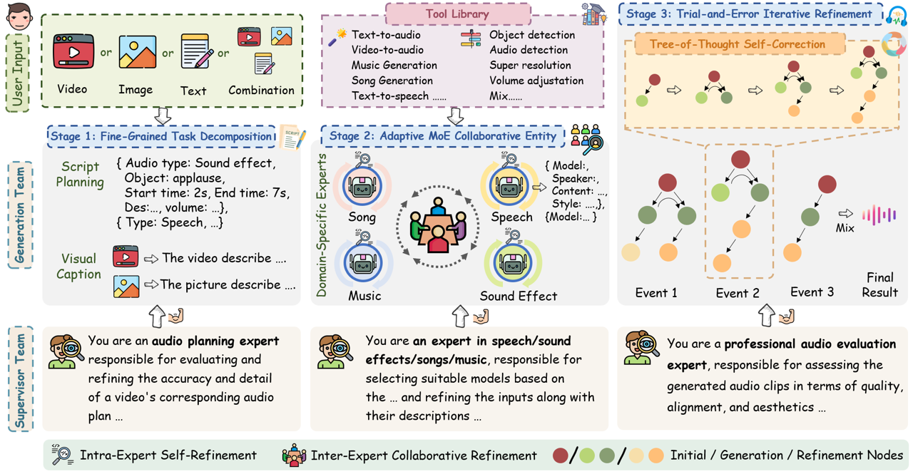
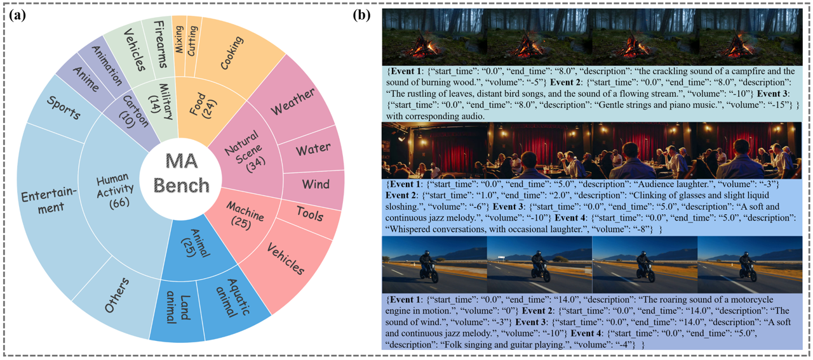

# 🎶 AudioGenie: A Training-Free Multi-Agent Framework for Diverse Multimodality-to-Multiaudio Generation

[](https://arxiv.org/pdf/2505.22053) 
[](https://audiogenie.github.io/)

---

**This is the official repository for "[AudioGenie: A Training-Free Multi-Agent Framework for Diverse Multimodality-to-Multiaudio Generation](https://arxiv.org/pdf/2505.22053)".**

## 🚀 Roadmap
- **2025/07**: AudioGenie has been accepted by ACM MM 2025!


## ✨ Abstract

Multimodality-to-Multiaudio (MM2MA) generation faces significant challenges in synthesizing diverse and contextually aligned audio types (e.g., sound effects, speech, music, and songs) from multimodal inputs (e.g., video, text, images), owing to the scarcity of high-quality paired datasets and the lack of robust multi-task learning frameworks. Recently, multi-agent system shows great potential in tackling the above issues. However, directly applying it to MM2MA task presents three critical challenges: (1) inadequate fine-grained understanding of multimodal inputs (especially for video), (2) the inability of single models to handle diverse audio events, and (3) the absence of self-correction mechanisms for reliable outputs. 
To this end, we propose AudioGenie, a novel training-free multi-agent system featuring a dual-layer architecture with a generation team and a supervisor team. For the generation team, a fine-grained task decomposition and an adaptive Mixture-of-Experts (MoE) collaborative entity are designed for detailed comprehensive multimodal understanding and dynamic model selection, and a trial-and-error iterative refinement module is designed for self-correction. The supervisor team ensures temporal-spatial consistency and verifies outputs through feedback loops. Moreover, we build MA-Bench, the first benchmark for MM2MA tasks, comprising 198 annotated videos with multi-type audios. 
Experiments demonstrate that our AudioGenie achieves state-of-the-art (SOTA) or comparable performance across 9 metrics in 8 tasks. User study further validates the effectiveness of our method in terms of quality, accuracy, alignment, and aesthetic.


## ✨ Method

<p align="center">
  
</p>

<p align="center"><strong>Overview of the AudioGenie Framework.</strong></p>


## 🔮 MA-Bench

The dataset will be been released on Hugging Face.

<p align="center">
  
</p>

<p align="center"><strong>Statistics of video categories within our MA-Bench.</strong></p>

## 🛠️ Environment Setup

- Create Anaconda Environment:
  
  ```bash
  git clone https://github.com/ryysayhi/AudioGenie.git
  cd AudioGenie
  conda create -n AudioGenie python=3.10
  conda activate AudioGenie
  pip install -r requirements.txt
  ```
- Install ffmpeg:
  
  ```bash
  sudo apt-get install ffmpeg
  ```

## 📀 Establish Tool Library

- In the `/bin` folder, we provide four examples: [MMAudio](https://github.com/hkchengrex/MMAudio), [CosyVoice](https://github.com/FunAudioLLM/CosyVoice), [InspireMusic](https://github.com/FunAudioLLM/FunMusic), [DiffRhythm](https://github.com/ASLP-lab/DiffRhythm).
You can clone each project and install it following its own guide. Then set:
  
  ```bash
  export MMAUDIO_HOME=<PATH_TO_MMAUDIO>
  export COSYVOICE_HOME=<PATH_TO_COSYVOICE>
  export INSPIREMUSIC_HOME=<PATH_TO_INSPIREMUSIC>
  export DIFFRHYTHM_HOME=<PATH_TO_DIFFRHYTHM>
  
  export MMAUDIO_CONDA=mmaudio
  export COSYVOICE_CONDA=cosyvoice
  export INSPIREMUSIC_CONDA=inspiremusic
  export DIFFRHYTHM_CONDA=diffrhythm
  ```
- To extend the library, add your preferred speech / song / music / sound-effect models by defining a `ToolSpec` in `tools.py`, and add a matching `run_model.py` in `/bin`.

## 🎯 Infer
We use Gemini as the MLLM in this repo. You can swap it for another MLLM (e.g., Qwen2.5-VL, which we used in the paper). 
- Set your API key for Gemini in run.py (or export it as an env var):
  ```bash
  os.environ['GEMINI_API_KEY'] = 'Your_Gemini_Api_Key'
  # or in shell:
  # export GEMINI_API_KEY=Your_Gemini_Api_Key
  ```


- Run the inference script:
  ```bash
  python AudioGenie/run.py \
    --video <PATH_TO_VIDEO or omit> \
    --image <PATH_TO_IMAGE or DIR or omit> \
    --text  "<YOUR_TEXT or omit>" \
    --outdir <OUTPUT_DIR>
  ```

## 📭 Contact

If you have any comments or questions, feel free to contact me (yrong854@connect.hkust-gz.edu.cn).

## 📚 Citation

If you find our work useful, please consider citing:

```
@article{rong2025audiogenie,
  title={AudioGenie: A Training-Free Multi-Agent Framework for Diverse Multimodality-to-Multiaudio Generation},
  author={Rong, Yan and Wang, Jinting and Lei, Guangzhi and Yang, Shan and Liu, Li},
  journal={arXiv preprint arXiv:2505.22053},
  year={2025}
}
```
